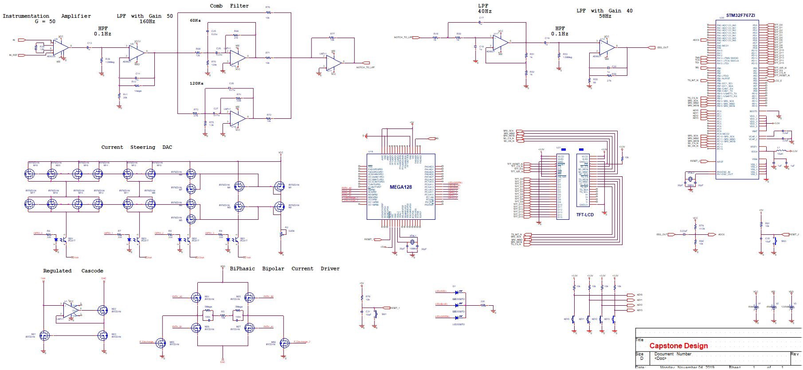
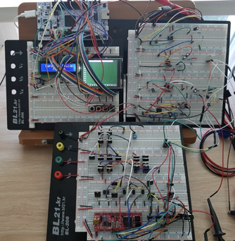

# Circuit
양방향 뇌신경 신호처리 시스템(bread board) 동영상

[조원의 개인 블로그에 기제](https://arkx.dev/?p=2113)
- 조원의 블로그 내용은 기존 회로를 개선하여 작성한 것으로 동일하지 않음.
- 영상에 나와았는 회로 형태가 최종 제출 작품이였음(시간상 발주할 경우 기간내 제작이 불가능했음)

## 회로 설계도

## 회로 구현

## Test

